# Hướng Dẫn & Điều Phối Dự Án (HCI - CSC12106)

## 1. Tổng quan dự án

- **Project**: Đồ án môn **Tương tác Người–Máy (CSC12106)** — Khoa CNTT, Trường Đại học Khoa học Tự nhiên (HCMUS).
- **Đề tài**: **Hệ thống hỗ trợ đặt lịch, gửi yêu cầu và theo dõi quá trình chăm sóc thú cưng**.
- **Đối tượng mục tiêu (Target Users)**: **Chủ nuôi thú cưng (Pet Owners)** — những người bận rộn, trực tiếp đặt dịch vụ tắm/cắt tỉa/chăm sóc, gửi yêu cầu dặn dò đặc biệt và cần theo dõi tình trạng thú cưng từ xa.
- **Mục tiêu cốt lõi**: Giải quyết bất cập của quy trình thủ công cũ qua 4 trụ cột trải nghiệm:
  1. *Đặt lịch có xác nhận tức thì*: Chọn dịch vụ và khung giờ còn trống, nhận xác nhận ngay trên ứng dụng.
  2. *Hồ sơ thú cưng & Yêu cầu đặc biệt*: Lưu tiền sử dị ứng, tính cách, thuốc và tự động đính kèm khi đặt lịch.
  3. *Theo dõi tiến độ theo thời gian thực*: Cập nhật minh bạch 4 mốc (*Đã nhận* ➔ *Đang chăm sóc* ➔ *Hoàn tất* ➔ *Chờ đón*).
  4. *Lịch sử chăm sóc cá nhân hóa*: Lưu chi tiết dịch vụ, sản phẩm sử dụng và ghi chú sau mỗi lượt.

---

## 2. Tech Stack

- **Giao diện Web (Software Product)**: React + TypeScript, HTML5, CSS3 (Modern Vanilla CSS), chuẩn **Mobile-first**.
- **Thiết kế UI/UX**: Figma (Wireframe, Interactive Prototype tương tác cao).
- **Công cụ tiện ích & Render hình ảnh**: Python 3.10+ (Script chuẩn trong thư mục `tools/`).
- **Quản lý mã nguồn**: Git & GitHub.

---

## 3. Điều Hướng Quy Tắc Thiết Kế & Nghiệp Vụ (Rules Directory Navigation)

AI Agent **không tự ý suy diễn quy tắc mà bắt buộc phải đọc và tuân thủ các tệp quy tắc chuyên biệt trong thư mục `rules/`** tương ứng với từng tác vụ:

- **Nghiệp vụ & Phạm vi đối tượng**: Đọc [`rules/domain-rules.md`](rules/domain-rules.md)
- **Phong cách thiết kế, Bảng màu, Biểu tượng & Cấm Emoji**: Đọc [`rules/style-rules.md`](rules/style-rules.md)
- **Bố cục, Kiểu chữ & Chống tràn chữ SVG (iPhone 14 Pro Max)**: Đọc [`rules/layout-and-typography-rules.md`](rules/layout-and-typography-rules.md)
- **Quản lý công cụ, Cấm tạo script/tool mới**: Đọc [`rules/tool-rules.md`](rules/tool-rules.md)
- **Chất lượng, Tính trung thực & Bằng chứng dữ liệu**: Đọc [`rules/quality-rules.md`](rules/quality-rules.md)
- **Đánh giá, Tiêu chuẩn Rubric & Nghiệm thu**: Đọc [`rules/assessment-rules.md`](rules/assessment-rules.md)
- **Quy tắc chuyên biệt theo từng deliverable**:
  - Persona: Đọc [`rules/persona-rules.md`](rules/persona-rules.md)
  - Value Proposition: Đọc [`rules/value-proposition-rules.md`](rules/value-proposition-rules.md)
  - Scenario Current: Đọc [`rules/scenario_current-rules.md`](rules/scenario_current-rules.md)
  - Scenario Future: Đọc [`rules/scenario_future-rules.md`](rules/scenario_future-rules.md)
  - Storyboard: Đọc [`rules/storyboard-rules.md`](rules/storyboard-rules.md)
  - Wireframe: Đọc [`rules/wireframe-rules.md`](rules/wireframe-rules.md)

---

## 4. Quy Tắc Vận Hành Bắt Buộc

### Những gì AI Assistant PHẢI làm

- **Giao tiếp chuẩn mực**: Trả lời bằng tiếng Việt rõ ràng, mạch lạc; giữ nguyên thuật ngữ chuyên ngành tiếng Anh chuẩn (Persona, Scenario, Storyboard, Wireframe, Prototype, Rubric, Props, Component...).
- **Trung thực với dữ liệu**: Mọi Persona, Value Proposition, Scenario, Storyboard, Prototype, Wireframe và Báo cáo phải bắt nguồn từ dữ liệu khảo sát/phỏng vấn thực tế trong `data/` và các deliverables đã hoàn thành.
- **Tuân thủ đúng phạm vi tài liệu (Scope Minimization)**: Khi thực thi vai trò nào, chỉ đọc đúng file định nghĩa của Subagent đó tại `agents/<agent-name>.md` và các file `rules/` liên quan.
- **Kiểm tra Tiền điều kiện Bắt buộc (Strict Precondition Enforcement)**: Luôn kiểm tra sự tồn tại của artifact tiền điều kiện theo đúng luồng Workflow. Nếu thiếu $\rightarrow$ **Dừng lại ngay lập tức (HALT)** và báo lỗi chi tiết, không làm nhảy cóc.

### Những gì AI Assistant KHÔNG ĐƯỢC làm

- **Tuyệt đối không bịa số liệu**, trích dẫn phỏng vấn, kết quả nghiên cứu hay bằng chứng đóng góp nhóm.
- **Không tự ý tạo nhảy cóc khi thiếu tiền điều kiện**: Không tạo Prototype khi chưa có Storyboard, không tạo Wireframe khi chưa có Prototype, không code phần mềm khi chưa có Wireframe & Prototype.
- **Không tự mở rộng phạm vi sản phẩm**: Giữ vững trọng tâm phục vụ chủ nuôi thú cưng bận rộn.
- **Không tự đổi Tech Stack**: Không tự thêm backend phức tạp hay đổi framework.
- **Tuyệt đối không tự ý chạy lệnh Git**: Không tự chạy `git status`, `git log`, `git diff` khi người dùng không yêu cầu.
- **Tuyệt đối KHÔNG tự ý tạo Script / Tool mới**: Tuân thủ nghiêm ngặt [`rules/tool-rules.md`](rules/tool-rules.md); chỉ dùng công cụ có sẵn trong `tools/` và sinh file trực tiếp vào `deliverables/`.

---

## 5. Workflow Toàn Diện Dự Án (End-to-End Workflow Pipeline)

Quy trình thực hiện đồ án môn học trải qua 11 giai đoạn nối tiếp chặt chẽ:

```mermaid
graph LR
    W1["01. User Discovery"] --> W2["02. Persona"]
    W2 --> W3["03. Value Proposition"]
    W3 --> W4["04. Scenario Current"]
    W4 --> W5["05. Scenario Future"]
    W5 --> W6["06. Storyboard"]
    W6 --> W7["07. Prototype"]
    W7 --> W8["08. Wireframe"]
    W8 --> W9["09. Evaluation"]
    W9 --> W10["10. Software Product"]
    W10 --> W11["11. Report"]
```

### 5.1. Chi tiết 11 bước trong Workflow

1. **User Discovery (Khám phá người dùng)**: Thu thập và tổng hợp dữ liệu phỏng vấn sâu, khảo sát thực tế của chủ nuôi thú cưng tại `data/`.
2. **Persona (Chân dung người dùng)**: Xây dựng bộ Persona đại diện (`deliverables/01-user-research/persona/`).
3. **Value Proposition (Tuyên ngôn giá trị)**: Thiết lập Value Proposition Canvas đối ứng trực tiếp với từng Persona (`deliverables/01-user-research/value-proposition/`).
4. **Scenario Current (Kịch bản hiện tại)**: Mô tả câu chuyện thực tế và các điểm đau của quy trình thủ công cũ (`deliverables/01-user-research/scenario-current/`).
5. **Scenario Future (Kịch bản tương lai To-Be)**: Thiết kế luồng tương tác cải tiến giải quyết các điểm đau (`deliverables/01-user-research/scenario-future/`).
6. **Storyboard (Bảng phân cảnh trực quan)**: Trực quan hóa câu chuyện trải nghiệm thành 6 khung tranh Expressive Stick-figure UI (`deliverables/02-interaction-design/storyboard/`). *(Tiền điều kiện: Scenario Future)*.
7. **Prototype (Mô hình tương tác cao)**: Xây dựng Interactive Prototype vector SVG chuẩn Figma cho từng kịch bản (`deliverables/02-interaction-design/prototype/`). *(Tiền điều kiện: Storyboard)*.
8. **Wireframe (Khung giao diện toàn hệ thống)**: Thiết kế bộ Wireframe tổng thể cho toàn bộ màn hình ứng dụng tích hợp đủ 5 trạng thái giao diện (`deliverables/02-interaction-design/wireframe/`). *(Tiền điều kiện: Prototype)*.
9. **Evaluation (Đánh giá giao diện & Trải nghiệm)**: Đánh giá Heuristic, kiểm tra độ bao phủ 5 UI states, kiểm thử khả năng tiếp cận và rà soát tiêu chí Rubric trước khi lập trình.
10. **Software Product (Sản phẩm phần mềm Web)**: Lập trình sản phẩm Web React + TypeScript hoàn chỉnh quy trình nghiệp vụ (`src/`, `deliverables/03-software-product/`). *(Tiền điều kiện: Wireframe & Prototype)*.
11. **Report & Final Submission (Báo cáo & Hoàn thiện đồ án)**: Biên soạn Báo cáo cuối kỳ (>6 trang), Slide thuyết trình và bảng phân công Teamwork (`deliverables/04-final-submission/`).

---

## 6. Bản Đồ Định Tuyến Subagent (Subagent Routing Table)

Khi thực thi từng giai đoạn trong Workflow, AI Agent kích hoạt Subagent tương ứng bằng cách đọc trực tiếp file định nghĩa gốc tại `agents/<agent-name>.md` (toàn bộ input, output, rules chi tiết và workflow đã được đóng gói đầy đủ tại đây):

| STT | Bước Workflow | Tên Subagent | File định nghĩa gốc (Source of Truth) |
| :---: | :--- | :--- | :--- |
| **1** | Persona | `persona-agent` | [`agents/persona-agent.md`](agents/persona-agent.md) |
| **2** | Value Proposition | `value-proposition-agent` | [`agents/value-proposition-agent.md`](agents/value-proposition-agent.md) |
| **3** | Scenario Current | `scenario-current-agent` | [`agents/scenario-current-agent.md`](agents/scenario-current-agent.md) |
| **4** | Scenario Future | `scenario-future-agent` | [`agents/scenario-future-agent.md`](agents/scenario-future-agent.md) |
| **5** | Storyboard | `storyboard-agent` | [`agents/storyboard-agent.md`](agents/storyboard-agent.md) |
| **6** | Prototype | `prototype-agent` | [`agents/prototype-agent.md`](agents/prototype-agent.md) |
| **7** | Wireframe | `wireframe-agent` | [`agents/wireframe-agent.md`](agents/wireframe-agent.md) |
| **8** | Software Product | `software-product-agent` | [`agents/software-product-agent.md`](agents/software-product-agent.md) |
| **9** | Presentation | `presentation-agent` | [`agents/presentation-agent.md`](agents/presentation-agent.md) |
| **10** | Report | `report-agent` | [`agents/report-agent.md`](agents/report-agent.md) |
| **11** | Teamwork | `teamwork-agent` | [`agents/teamwork-agent.md`](agents/teamwork-agent.md) |
| **Hỗ trợ** | Figma SVG Vector | `figma-agent` | [`agents/figma-agent.md`](agents/figma-agent.md) |

---

## 7. Công Cụ Hỗ Trợ Chuẩn Hóa (Standard Tools)

Chỉ được phép dùng 3 công cụ chính thức trong thư mục `tools/`:

1. `tools/generate-figma-svg.py`: Công cụ hỗ trợ sinh mã vector SVG chuẩn Figma.
2. `tools/render-html-to-png.py`: Công cụ kết xuất HTML sang PNG độ nét cao (sử dụng cho Persona, Storyboard).
3. `tools/validate-svg.py`: Công cụ kiểm thử & đánh giá hợp lệ mã SVG (iPhone 14 Pro Max, chống tràn chữ, cấm emoji, layer Figma).
