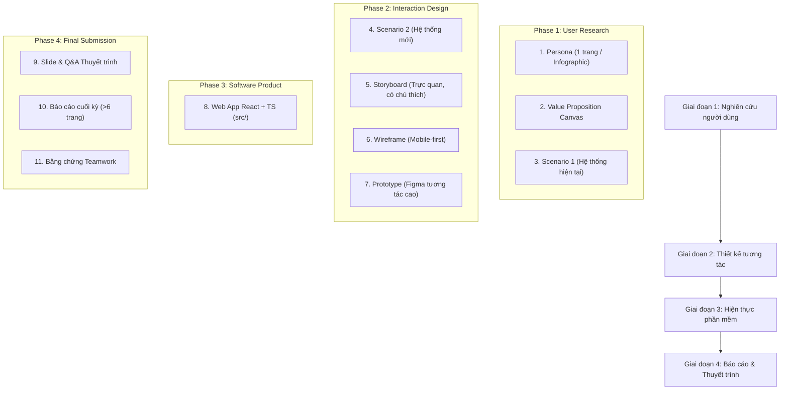

# Hướng Dẫn & Quy Tắc Dự Án (HCI - CSC12106)

## 1. Tổng quan dự án

- **Project này là gì**: Đồ án môn **Tương tác Người–Máy (CSC12106)** — Khoa CNTT, Trường Đại học Khoa học Tự nhiên (HCMUS). Đề tài: **Hệ thống hỗ trợ đặt lịch, gửi yêu cầu và theo dõi quá trình chăm sóc thú cưng**.
- **Làm cho ai dùng (Đối tượng mục tiêu)**: **Chủ nuôi thú cưng (Pet Owners)** — những người bận rộn, trực tiếp đặt dịch vụ tắm/cắt tỉa/chăm sóc, gửi yêu cầu dặn dò đặc biệt và cần theo dõi tình trạng thú cưng từ xa.
- **Mục đích là gì**: Giải quyết các bất cập của quy trình thủ công cũ (chờ xác nhận lâu, thất lạc thông tin dị ứng/thuốc, thiếu cập nhật tiến độ trong lúc chăm sóc) bằng trải nghiệm liền mạch xoay quanh 4 tính năng cốt lõi:
  1. *Đặt lịch có xác nhận tức thì*: Chọn dịch vụ và khung giờ còn trống, nhận xác nhận ngay trên ứng dụng.
  2. *Hồ sơ thú cưng & Yêu cầu đặc biệt*: Lưu tiền sử dị ứng, tính cách, thuốc và tự động đính kèm khi đặt lịch.
  3. *Theo dõi tiến độ theo thời gian thực*: Cập nhật minh bạch 4 mốc (*Đã nhận* ➔ *Đang chăm sóc* ➔ *Hoàn tất* ➔ *Chờ đón*).
  4. *Lịch sử chăm sóc cá nhân hóa*: Lưu chi tiết dịch vụ, sản phẩm sử dụng và ghi chú sau mỗi lượt.

---

## 2. Tech Stack

- **Giao diện Web (Software Product)**: React + TypeScript, HTML5, CSS3 (Modern Vanilla CSS), thiết kế theo chuẩn **Mobile-first**.
- **Thiết kế UI/UX**: Figma (Wireframe, Interactive Prototype tương tác cao).
- **Công cụ tiện ích & Render hình ảnh**: Python 3.10+ (Script `tools/render-html-to-png.py` kết xuất HTML sang PNG độ nét cao cho Persona, Storyboard, Infographic).
- **Quản lý mã nguồn**: Git & GitHub.

---

## 3. Quy tắc thiết kế

- **Màu sắc chủ đạo (Color Palette)**:
  - *Primary (Thương hiệu/Hành động chính)*: Xanh mòng két dịu mát (`#0d766e` / `#0f4c45`), nền nhạt (`#f0fdfa`), viền mờ (`#ccfbf1`).
  - *Accent (Điểm nhấn & Cảnh báo)*: Cam san hô (`#e06236`), Hổ phách (`#d97706`), Đỏ hồng cảnh báo dị ứng (`#be123c`).
  - *Neutral (Nền & Văn bản)*: Nền trang sáng (`#f8fafc`), bề mặt thẻ trắng (`#ffffff`), viền phân cách (`#e2e8f0`), chữ chính (`#0f172a`), chữ phụ (`#64748b`).
- **Font chữ (Typography)**:
  - Ưu tiên font `Plus Jakarta Sans` hoặc system fonts hiện đại (`-apple-system`, `BlinkMacSystemFont`, `Segoe UI`, `Roboto`).
  - Phân cấp kích thước rõ ràng, dòng đọc thoáng (`line-height: 1.4 – 1.6`), chữ hiển thị sắc nét.
- **Style tổng thể**:
  - Hiện đại, tối giản, thân thiện với chủ nuôi thú cưng (Pet-friendly & Human-centered).
  - Bo góc mềm mại (`border-radius: 6px – 18px`), đổ bóng nhẹ tạo chiều sâu (`shadow-sm`, `shadow-md`).
  - Tiến độ trực quan qua Timeline Stepper 4 mốc rõ ràng.

---

## 4. Quy tắc bắt buộc

### Những gì AI Assistant PHẢI làm:
- **Giao tiếp & Tài liệu**: Trả lời và viết tài liệu bằng tiếng Việt rõ ràng, mạch lạc; giữ nguyên các thuật ngữ chuyên ngành tiếng Anh chuẩn (Persona, Scenario, Storyboard, Wireframe, Prototype, Rubric, Props, Component...).
- **Tính trung thực với dữ liệu**: Mọi Persona, Value Proposition, Scenario và bài báo cáo đều phải xuất phát từ dữ liệu phỏng vấn/khảo sát thực tế trong `data/` và `deliverables/`.
- **Bám sát yêu cầu**: Bám sát 11 mục tiêu chí trong [docs/final-rubric.csv](docs/final-rubric.csv) và đề xuất trong [docs/proposal.md](docs/proposal.md).
- **Pair Programming trực tiếp**: Hỗ trợ trực tiếp trên codebase, viết code sạch, kiểm thử cẩn thận và thực hiện commit khi hoàn tất công việc.

### Những gì AI Assistant KHÔNG ĐƯỢC làm:
- **Tuyệt đối không tự bịa số liệu**, trích dẫn phỏng vấn, kết quả nghiên cứu hay bằng chứng đóng góp nhóm.
- **Không tự mở rộng phạm vi sản phẩm**: Không tự ý biến ứng dụng thành hệ thống quản lý cơ sở/ERP phòng khám phức tạp ngoài phạm vi dành cho chủ nuôi.
- **Không tự đổi Tech Stack**: Không tự thêm backend phức tạp hay đổi framework khi chưa có yêu cầu từ người dùng.
- **Không tạo cơ chế rào cản**: Không cài đặt các cơ chế khóa commit hay quy trình điều phối rườm rà.

---

## 5. Workflow (Các bước làm việc trong project)

1. **Giai đoạn 1: Nghiên cứu người dùng (`deliverables/01-user-research/`)**
   - Tổng hợp ghi chép phỏng vấn từ `data/user-research/`.
   - Hoàn thiện **Persona** chuẩn 1 trang (kèm ảnh minh họa & HTML/PNG).
   - Xây dựng **Value Proposition Canvas** (đối ứng 1-1 với Persona).
   - Viết **Scenario 1** (mô tả khó khăn và bất cập của hệ thống cũ).
2. **Giai đoạn 2: Thiết kế tương tác (`deliverables/02-interaction-design/`)**
   - Viết **Scenario 2** (thể hiện rõ các bước tương tác cải tiến của hệ thống mới).
   - Tạo **Storyboard** trực quan kèm chú thích câu chuyện.
   - Thiết kế **Wireframe** mobile-first chi tiết, tiện dụng.
   - Xây dựng **Prototype** tương tác cao trên Figma mô phỏng 4 luồng nghiệp vụ cốt lõi.
3. **Giai đoạn 3: Hiện thực phần mềm (`src/` & `deliverables/03-software-product/`)**
   - Khởi tạo và phát triển ứng dụng Web React + TypeScript theo chuẩn mobile-first.
   - Cài đặt trọn vẹn 100% các tính năng tương tác mới và kiểm thử trải nghiệm.
4. **Giai đoạn 4: Hoàn thiện báo cáo & Bảo vệ (`deliverables/04-final-submission/`)**
   - Soạn slide thuyết trình và chuẩn bị các câu hỏi Q&A phản biện.
   - Viết báo cáo cuối kỳ đầy đủ format, minh chứng (>6 trang).
   - Tổng hợp minh chứng đóng góp teamwork công bằng, rõ ràng.
