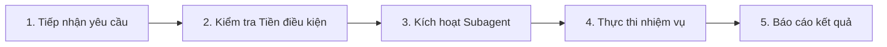
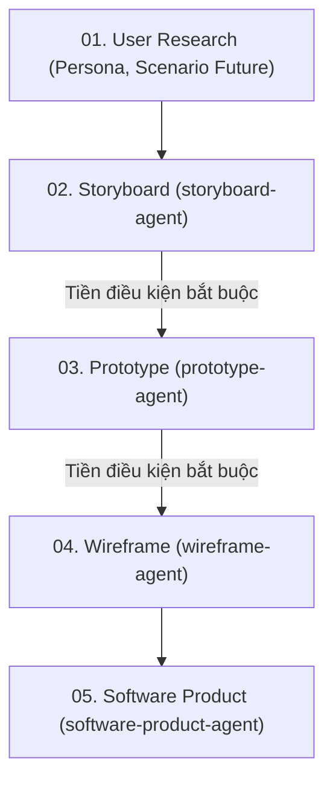

# Hướng Dẫn & Quy Tắc Dự Án (HCI - CSC12106)

## 1. Tổng quan dự án

- **Project này là gì**: Đồ án môn **Tương tác Người–Máy (CSC12106)** — Khoa CNTT, Trường Đại học Khoa học Tự nhiên (HCMUS). Đề tài: **Hệ thống hỗ trợ đặt lịch, gửi yêu cầu và theo dõi quá trình chăm sóc thú cưng**.
- **Làm cho ai dùng (Đối tượng mục tiêu)**: **Chủ nuôi thú cưng (Pet Owners)** — những người bận rộn, trực tiếp đặt dịch vụ tắm/cắt tỉa/chăm sóc, gửi yêu cầu dặn dò đặc biệt và cần theo dõi tình trạng thú cưng từ xa.
- **Mục đích là gì**: Giải quyết các bất cập của quy trình thủ công cũ (chờ xác nhận lâu, thất lạc thông tin dị ứng/thuốc, thiếu cập nhật tiến độ trong lúc chăm sóc) bằng trải nghiệm liền mạch xoay quanh 4 tính năng cốt lõi:
  1. *Đặt lịch có xác nhận tức thì*: Chọn dịch vụ và khung giờ còn trống, nhận xác nhận ngay trên ứng dụng.
  2. *Hồ sơ thú cưng & Yêu cầu đặc biệt*: Lưu tiền sử dị ứng, tính cách, thuốc và tự động đính kèm khi đặt lịch.
  3. *Theo dõi tiến độ theo thời gian thực*: Cập nhật minh bạch 4 mốc (*Đã nhận* ➔ *Đang chăm sóc* ➔ *Hoàn tất* ➔ *Chờ đón*).
  4. *Lịch sử chăm sóc cá nhân hóa*: Lưu chi tiết dịch vụ, sản phẩm sử dụng và ghi chú sau mỗi lượt.

---

## 2. Tech Stack

- **Giao diện Web (Software Product)**: React + TypeScript, HTML5, CSS3 (Modern Vanilla CSS), thiết kế theo chuẩn **Mobile-first**.
- **Thiết kế UI/UX**: Figma (Wireframe, Interactive Prototype tương tác cao).
- **Công cụ tiện ích & Render hình ảnh**: Python 3.10+ (Script `tools/render-html-to-png.py` kết xuất HTML sang PNG độ nét cao cho Persona, Storyboard, Infographic).
- **Quản lý mã nguồn**: Git & GitHub.

---

## 3. Quy tắc thiết kế

- **Màu sắc chủ đạo (Color Palette)**:
  - *Primary (Thương hiệu/Hành động chính)*: Xanh mòng két dịu mát (`#0d766e` / `#0f4c45`), nền nhạt (`#f0fdfa`), viền mờ (`#ccfbf1`).
  - *Accent (Điểm nhấn & Cảnh báo)*: Cam san hô (`#e06236`), Hổ phách (`#d97706`), Đỏ hồng cảnh báo dị ứng (`#be123c`).
  - *Neutral (Nền & Văn bản)*: Nền trang sáng (`#f8fafc`), bề mặt thẻ trắng (`#ffffff`), viền phân cách (`#e2e8f0`), chữ chính (`#0f172a`), chữ phụ (`#64748b`).
- **Font chữ (Typography)**:
  - Ưu tiên font `Plus Jakarta Sans` hoặc system fonts hiện đại (`-apple-system`, `BlinkMacSystemFont`, `Segoe UI`, `Roboto`).
  - Phân cấp kích thước rõ ràng, dòng đọc thoáng (`line-height: 1.4 – 1.6`), chữ hiển thị sắc nét.
- **Style tổng thể**:
  - Hiện đại, tối giản, thân thiện với chủ nuôi thú cưng (Pet-friendly & Human-centered).
  - Bo góc mềm mại (`border-radius: 6px – 18px`), đổ bóng nhẹ tạo chiều sâu (`shadow-sm`, `shadow-md`).
  - Tiến độ trực quan qua Timeline Stepper 4 mốc rõ ràng.

---

## 4. Quy tắc bắt buộc

### Những gì AI Assistant PHẢI làm

- **Giao tiếp & Tài liệu**: Trả lời và viết tài liệu bằng tiếng Việt rõ ràng, mạch lạc; giữ nguyên các thuật ngữ chuyên ngành tiếng Anh chuẩn (Persona, Scenario, Storyboard, Wireframe, Prototype, Rubric, Props, Component...).
- **Tính trung thực với dữ liệu**: Mọi Persona, Value Proposition, Scenario và bài báo cáo đều phải xuất phát từ dữ liệu phỏng vấn/khảo sát thực tế trong `data/` và `deliverables/`.
- **Bám sát yêu cầu**: Thực hiện đủ và đúng yêu cầu người dùng đưa
- **Tôn trọng workflow**: Tuân thủ các workflow mà làm việc, không làm ngoài phạm vi workflow.
- **Tuân thủ đúng phạm vi tài liệu (Scope Minimization)**: Khi thực thi nhiệm vụ theo vai trò của Agent nào, chỉ được đọc và tham chiếu đúng các file được liệt kê trong định nghĩa của Agent đó (`agents/<tên-agent>.md`) và dữ liệu đầu vào trong `data/`.
- **Từ ngữ dễ hiều**: Ưu tiên sử dụng những từ ngữ dễ hiểu cho người Việt.
- **Kiểm tra Tiền điều kiện Bắt buộc (Strict Precondition Enforcement)**:
  - **Khi tạo Prototype**: Bắt buộc **phải dựa trên Storyboard** tương ứng (`deliverables/02-interaction-design/storyboard/<persona-id>/<goal-id>/`). Nếu thiếu Storyboard, **tuyệt đối KHÔNG ĐƯỢC PHÉP tạo Prototype mà PHẢI BÁO LỖI VÀ DỪNG LẠI NGAY LẬP TỨC**.
  - **Khi tạo Wireframe**: Bắt buộc **phải dựa trên Prototype** tương ứng (`deliverables/02-interaction-design/prototype/<persona-id>/<goal-id>/`). Nếu thiếu Prototype, **tuyệt đối KHÔNG ĐƯỢC PHÉP tạo Wireframe mà PHẢI BÁO LỖI VÀ DỪNG LẠI NGAY LẬP TỨC**.
  - Luôn kiểm tra sự tồn tại của artifact tiền điều kiện ngay bước đầu; nếu thiếu, đưa ra thông báo lỗi chi tiết nêu rõ artifact còn thiếu và dừng thực thi, hướng dẫn người dùng kích hoạt Agent phù hợp để tạo artifact tiền điều kiện trước.

### Những gì AI Assistant KHÔNG ĐƯỢC làm

- **Tuyệt đối không tự bịa số liệu**, trích dẫn phỏng vấn, kết quả nghiên cứu hay bằng chứng đóng góp nhóm.
- **Không tự ý tạo "nhảy cóc" khi thiếu tiền điều kiện**: Tuyệt đối không tự ý tạo Prototype khi chưa có Storyboard, không tự ý tạo Wireframe khi chưa có Prototype.
- **Không tự mở rộng phạm vi sản phẩm**: Không tự ý biến ứng dụng thành hệ thống quản lý cơ sở/ERP phòng khám phức tạp ngoài phạm vi dành cho chủ nuôi.
- **Không tự đổi Tech Stack**: Không tự thêm backend phức tạp hay đổi framework khi chưa có yêu cầu từ người dùng.
- **Không tự ý đọc lan man ngoài phạm vi**: Tuyệt đối không tự ý mở, đọc hoặc quét qua các file rules khác, tài liệu môn học (`references/`), deliverables hay template của các giai đoạn/agent khác khi không được workflow hoặc người dùng yêu cầu.
- **Tuyệt đối không tự ý chạy lệnh Git / kiểm tra Git**: Không chạy `git status`, `git log`, `git diff` hoặc các lệnh git để tra cứu lịch sử repo/thư mục khi người dùng không yêu cầu.
- **Không tự ý tạo file ngoài đặc tả**: Chỉ tạo đúng các định dạng file được quy định rõ trong workflow của từng Agent — tuyệt đối không tự ý tạo thêm file `.md` hay các file phụ trợ ngoài danh mục.
- **Tuyệt đối KHÔNG tự ý tạo Script / Tool mới**: Tuân thủ nghiêm ngặt [rules/tool-rules.md](rules/tool-rules.md); không tự tạo script tạm trong `tools/` hay trong project; chỉ dùng công cụ có sẵn và sinh trực tiếp file đầu ra vào `deliverables/`.

---

## 5. Workflow

1. **Tiếp nhận yêu cầu**: Lắng nghe yêu cầu cụ thể từ người dùng về tính năng, tài liệu, thiết kế hoặc kiểm thử.
2. **Kiểm tra Tiền điều kiện & Nắm rõ yêu cầu**:
   - Phân tích mục tiêu, phạm vi công việc và kiểm tra sự tồn tại của **artifact tiền điều kiện**:
     - Cần làm **Storyboard** $\rightarrow$ Tiền điều kiện: `scenario-future` tương ứng.
     - Cần làm **Prototype** $\rightarrow$ Tiền điều kiện: `storyboard` tương ứng. *(Nếu thiếu $\rightarrow$ Báo lỗi & Dừng lại)*.
     - Cần làm **Wireframe** $\rightarrow$ Tiền điều kiện: `prototype` tương ứng. *(Nếu thiếu $\rightarrow$ Báo lỗi & Dừng lại)*.
     - Cần làm **Software Product** $\rightarrow$ Tiền điều kiện: `wireframe` & `prototype` tương ứng.
   - Nếu thiếu bất kỳ tiền điều kiện nào: **Báo lỗi cụ thể và dừng lại ngay**, yêu cầu người dùng hoàn thành bước trước.
3. **Tìm kiếm & Sử dụng Subagent thích hợp**:
   - Xác định và áp dụng kỹ năng/subagent phù hợp theo 11 chuyên môn:
     - `persona-agent`: Xây dựng Persona chuẩn 1 trang từ dữ liệu phỏng vấn.
     - `value-proposition-agent`: Lập Value Proposition Canvas tương ứng Persona.
     - `scenario-current-agent`: Mô tả kịch bản và khó khăn của quy trình cũ.
     - `scenario-new-agent`: Thiết kế kịch bản luồng tương tác mới.
     - `storyboard-agent`: Soạn kịch bản và tạo Storyboard trực quan (Tiền điều kiện cho Prototype).
     - `prototype-agent`: Quản lý và xây dựng Interactive Prototype từ Storyboard (Tiền điều kiện cho Wireframe).
     - `wireframe-agent`: Thiết kế Wireframe mobile-first 5 trạng thái dựa trên Prototype.
     - `software-product-agent`: Lập trình ứng dụng Web React + TypeScript (`src/`).
     - `presentation-agent`: Soạn Slide thuyết trình và nội dung Q&A phản biện.
     - `report-agent`: Tổng hợp và biên soạn Báo cáo cuối kỳ (>6 trang).
     - `teamwork-agent`: Tổng hợp phân công và minh chứng đóng góp thực tế.
4. **Thực thi nhiệm vụ**:
   - Tiến hành viết code, cập nhật tài liệu, xuất hình ảnh hoặc chạy script kiểm thử theo đúng quy chuẩn thiết kế và kỹ thuật.
5. **Báo cáo kết quả**:
   - Trình bày kết quả rõ ràng, dẫn link file đã tạo/sửa, tóm tắt các điểm quan trọng và sẵn sàng nhận phản hồi để hoàn thiện tiếp.
