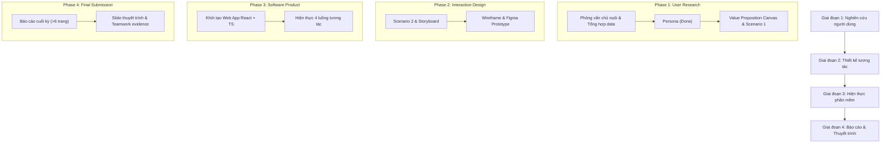

# Lộ trình & Tiến độ Dự án HCI (CSC12106)

Tài liệu theo dõi **tiến độ thực tế** và **kế hoạch hành động** của dự án Đặt lịch & Theo dõi Chăm sóc Thú cưng.

---

## 1. Trạng thái Tiến độ 11 Deliverables (Theo Rubric)

| # | Deliverable | Nhóm thư mục | Trạng thái | Vị trí Artifact / Ghi chú |
| --- | --- | --- | --- | --- |
| 1 | **Persona** | `01-user-research` | 🟢 Hoàn thành | `deliverables/01-user-research/persona.{html,png,json}` |
| 2 | **Value Proposition** | `01-user-research` | 🟢 Hoàn thành | Khớp 1-1 giữa Persona & VPC (`value-proposition.json`, `value-proposition.png`) |
| 3 | **Scenario 1 (Hiện tại)** | `01-user-research` | 🟢 Hoàn thành | Mô tả khó khăn của quy trình cũ (`scenario-current/`) |
| 4 | **Scenario 2 (Mới)** | `02-interaction-design` | 🔴 Chưa bắt đầu | Mô tả các mốc tương tác cải tiến của hệ thống mới |
| 5 | **Storyboard** | `02-interaction-design` | 🔴 Chưa bắt đầu | Kịch bản câu chuyện & hình minh họa trực quan |
| 6 | **Prototype (Figma)** | `02-interaction-design` | 🔴 Chưa bắt đầu | Thiết kế Figma mô phỏng 4 luồng cốt lõi |
| 7 | **Wireframe** | `02-interaction-design` | 🔴 Chưa bắt đầu | Bản vẽ giao diện chi tiết, tiện dụng, mobile-first |
| 8 | **Software Product** | `03-software-product` | 🔴 Chưa bắt đầu | Web App React + TypeScript trong `src/` |
| 9 | **Trình bày** | `04-final-submission` | 🔴 Chưa bắt đầu | Slide thuyết trình & kịch bản Q&A phản biện |
| 10 | **Báo cáo cuối kỳ** | `04-final-submission` | 🔴 Chưa bắt đầu | Báo cáo hoàn chỉnh đúng format (>6 trang) |
| 11 | **Team work** | `04-final-submission` | ⏳ Đang ghi nhận | Bằng chứng phân công và lịch sử đóng góp thực tế |

---

## 2. Kế hoạch Thực hiện Theo 4 Giai đoạn

### Chi tiết các bước thực hiện

1. **Giai đoạn 1: Nghiên cứu Người dùng (`01-user-research`)**
   - Đã hoàn thành Persona đại diện từ dữ liệu phỏng vấn thực tế.
   - Tiếp tục xây dựng **Value Proposition Canvas** và **Scenario 1 (Hiện tại)** làm cơ sở cho thiết kế tương tác mới.

2. **Giai đoạn 2: Thiết kế Tương tác (`02-interaction-design`)**
   - Xây dựng **Scenario 2 (Hệ thống mới)** giải quyết các pain points.
   - Thiết kế **Storyboard** minh họa câu chuyện sử dụng thực tế.
   - Tạo **Wireframe** và **Prototype tương tác cao trên Figma**.

3. **Giai đoạn 3: Phát triển Phần mềm (`03-software-product`)**
   - Xây dựng ứng dụng web mobile-first bằng React + TypeScript trong thư mục `src/`.
   - Đảm bảo hiện thực đầy đủ các luồng nghiệp vụ: đặt lịch tức thì, hồ sơ đính kèm yêu cầu đặc biệt, cập nhật tiến độ 4 mốc và lịch sử chăm sóc.

4. **Giai đoạn 4: Hoàn thiện Báo cáo & Bảo vệ (`04-final-submission`)**
   - Tổng hợp báo cáo tổng kết chi tiết đầy đủ minh chứng.
   - Chuẩn bị slide thuyết trình, kịch bản trả lời phản biện và tài liệu ghi nhận teamwork.
