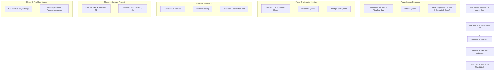

# Lộ trình & Tiến độ Dự án HCI (CSC12106)

Tài liệu theo dõi **tiến độ thực tế** và **kế hoạch hành động** của dự án Đặt lịch & Theo dõi Chăm sóc Thú cưng.

---

## 1. Trạng thái Tiến độ 12 Deliverables (Theo Rubric)

| # | Deliverable | Nhóm thư mục | Trạng thái | Vị trí Artifact / Ghi chú |
| --- | --- | --- | --- | --- |
| 1 | **Persona** | `01-user-research` | 🟢 Hoàn thành | Hai Persona và dữ liệu truy vết tại `deliverables/01-user-research/persona/` |
| 2 | **Value Proposition** | `01-user-research` | 🟢 Hoàn thành | VPC tương ứng với hai Persona tại `deliverables/01-user-research/value-proposition/` |
| 3 | **Scenario 1 (Hiện tại)** | `01-user-research` | 🟢 Hoàn thành | Mô tả khó khăn của quy trình cũ (`scenario-current/`) |
| 4 | **Scenario 2 (Mới)** | `01-user-research` | 🟢 Hoàn thành | Sáu Scenario Future theo hai Persona và ba Goal tại `scenario-future/` |
| 5 | **Storyboard** | `02-interaction-design` | 🟢 Hoàn thành | Hai Storyboard có dữ liệu, chú thích và hình minh họa tại `storyboard/` |
| 6 | **Wireframe** | `02-interaction-design` | 🟢 Hoàn thành | Bộ 18 màn hình Wireframe bổ trợ (13 màn hình phân hệ và 5 màn hình trạng thái biên) tối giản theo nguyên tắc 'Người dùng không đọc', đồng bộ 100% phong cách với 35 màn hình Prototype tại `deliverables/02-interaction-design/wireframe/` |
| 7 | **Prototype** | `02-interaction-design` | 🟢 Hoàn thành | Bộ màn hình Interactive Prototype SVG cho kịch bản mục tiêu tại `deliverables/02-interaction-design/prototype/`; người dùng tự import và kết nối trên Figma |
| 8 | **Evaluation** | `02-interaction-design` | 🟢 Hoàn thành | Báo cáo Usability Testing, phân tích chỉ số thực nghiệm và đề xuất cải tiến tại `deliverables/02-interaction-design/evaluation/` |
| 9 | **Software Product** | `03-software-product` | 🔴 Chưa bắt đầu | Web App React + TypeScript trong `src/` |
| 10 | **Trình bày** | `04-final-submission` | 🔴 Chưa bắt đầu | Slide thuyết trình & kịch bản Q&A phản biện |
| 11 | **Báo cáo cuối kỳ** | `04-final-submission` | 🔴 Chưa bắt đầu | Báo cáo hoàn chỉnh đúng format (>6 trang) |
| 12 | **Team work** | `04-final-submission` | ⏳ Đang ghi nhận | Bằng chứng phân công và lịch sử đóng góp thực tế |

---

## 2. Kế hoạch Thực hiện Theo 5 Giai đoạn

### Chi tiết các bước thực hiện

1. **Giai đoạn 1: Nghiên cứu Người dùng (`01-user-research`)**
   - Đã hoàn thành Persona đại diện từ dữ liệu phỏng vấn thực tế.
   - Đã hoàn thành **Value Proposition Canvas**, **Scenario 1 (Hiện tại)** và **Scenario 2 (Mới)** làm cơ sở cho thiết kế tương tác.

2. **Giai đoạn 2: Thiết kế Tương tác (`02-interaction-design`)**
   - Đã hoàn thành Storyboard cho `persona-1/goal-3` và `persona-2/goal-1`.
   - Đã hoàn thành hệ thống **Wireframe** bổ trợ (18 màn hình: 13 màn hình phân hệ và 5 màn hình trạng thái biên) tối giản hóa theo nguyên tắc 'Người dùng không đọc', đồng bộ 100% phong cách thẩm mỹ với 35 Prototype hiện có cùng tài liệu đặc tả `wireframe-spec.md`.
   - Đã hoàn thành bộ **Prototype** SVG tương tác cao cho kịch bản mục tiêu kế thừa cấu trúc Wireframe; người dùng tự import và kết nối tương tác trên Figma.

3. **Giai đoạn 3: Evaluation (`02-interaction-design/evaluation`)**
   - **Mục tiêu:** kiểm tra người dùng có hoàn thành được luồng đặt lịch, hiểu phản hồi hệ thống và nhận ra các tương tác mới hay không.
   - **Phương pháp:** Moderated Usability Testing kết hợp Think-aloud; chốt Prototype/Wireframe dùng để kiểm thử trước khi tuyển người tham gia.
   - **Người tham gia:** dự kiến 5 Pet Owner phù hợp với nhóm người dùng mục tiêu; ẩn danh bằng mã `P01`–`P05`.
   - **Nhiệm vụ:** mở luồng đặt lịch, chọn thú cưng, chọn dịch vụ đã lưu, chọn khung giờ, kiểm tra thông tin và xác nhận đặt lịch.
   - **Chỉ số:** Task success, Time on task, Error count, Assistance count, SEQ sau từng nhiệm vụ và SUS sau toàn bộ buổi kiểm thử.
   - **Quy trình:** giới thiệu và xin đồng thuận → câu hỏi sàng lọc → hướng dẫn Think-aloud → thực hiện nhiệm vụ → SEQ/SUS → phỏng vấn cuối buổi.
   - **Đạo đức và dữ liệu:** thông báo đây là đánh giá sản phẩm, chỉ ghi âm/ghi hình khi được đồng ý, không công bố thông tin nhận dạng và cho phép dừng bất cứ lúc nào.
   - **Phân tích:** tổng hợp kết quả định lượng, mã hóa nhận xét định tính, nhóm Usability Issue và xếp mức độ nghiêm trọng từ 0–3.
   - **Đầu ra:** Evaluation Plan, Test Script, Task Sheet, Consent Form, Observation Sheet, Raw Results, Findings và danh sách đề xuất cải tiến có mức độ ưu tiên.
   - Chỉ đánh dấu **Hoàn thành** khi đã có dữ liệu kiểm thử thực tế và kết luận có bằng chứng; không tự tạo số liệu hoặc nhận xét người tham gia.

4. **Giai đoạn 4: Phát triển Phần mềm (`03-software-product`)**
   - Xây dựng ứng dụng web mobile-first bằng React + TypeScript trong thư mục `src/`.
   - Đảm bảo hiện thực đầy đủ các luồng nghiệp vụ: đặt lịch tức thì, hồ sơ đính kèm yêu cầu đặc biệt, cập nhật tiến độ 4 mốc và lịch sử chăm sóc.

5. **Giai đoạn 5: Hoàn thiện Báo cáo & Bảo vệ (`04-final-submission`)**
   - Tổng hợp báo cáo tổng kết chi tiết đầy đủ minh chứng.
   - Chuẩn bị slide thuyết trình, kịch bản trả lời phản biện và tài liệu ghi nhận teamwork.
