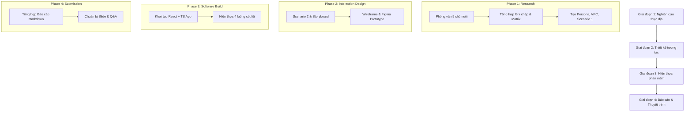

# Lộ trình & Tiến độ Dự án HCI (CSC12106)

Tài liệu này lưu trữ tập trung **trạng thái tiến độ hiện tại** và **kế hoạch làm việc** của dự án Đặt lịch & Theo dõi Chăm sóc Thú cưng.

---

## 1. Trạng thái Tiến độ 11 Deliverables (Theo Rubric)

| # | Deliverable | Nhóm | Trạng thái | Vị trí Artifact / Ghi chú |
|---|---|---|---|---|
| 1 | **Persona** | `01-user-research` | ⏳ Chờ dữ liệu phỏng vấn | Cần 5 phiên phỏng vấn chủ nuôi thực tế |
| 2 | **Value Proposition** | `01-user-research` | ⏳ Chờ dữ liệu phỏng vấn | Khớp 1-1 giữa Persona & VPC |
| 3 | **Scenario 1** (Hiện tại) | `01-user-research` | ⏳ Chờ dữ liệu phỏng vấn | Mô tả khó khăn hệ thống cũ |
| 4 | **Scenario 2** (Mới) | `02-interaction-design` | 🔴 Chưa bắt đầu | Khái niệm các bước tương tác mới |
| 5 | **Storyboard** | `02-interaction-design` | 🔴 Chưa bắt đầu | Kịch bản câu chuyện & hình minh họa |
| 6 | **Prototype** | `02-interaction-design` | 🔴 Chưa bắt đầu | Thiết kế Figma minh họa tương tác mới |
| 7 | **Wireframe** | `02-interaction-design` | 🔴 Chưa bắt đầu | Giao diện chi tiết, màu sắc hài hòa |
| 8 | **Software product** | `03-software-product` | 🔴 Chưa bắt đầu | Mã nguồn React + TypeScript (mobile-first) |
| 9 | **Trình bày** | `04-final-submission` | 🔴 Chưa bắt đầu | Slide & nội dung Q&A |
| 10 | **Báo cáo** | `04-final-submission` | 🔴 Chưa bắt đầu | Báo cáo Markdown đầy đủ (>6 trang) |
| 11 | **Team work** | `04-final-submission` | 🟢 Đã thiết lập | `coordination/PROTOCOL.md` & `AGENTS.md` |

---

## 2. Nhật ký Công việc & PRs đã hoàn thành

- **`TASK-REF-001`**: Tạo thư viện tài liệu tham khảo `references/` (`done`).
- **`TASK-KNOW-001`**: Chuyển đổi slide PDF/XLSX môn học thành ghi chú Markdown (`done`).
- **`TASK-RES-001`**: Xây dựng Giao thức Nghiên cứu người dùng đầy đủ trong `deliverables/01-user-research/` (`done`).
- **PR #1** (`fix: add python3->python fallback for Windows Git Bash support`): Hỗ trợ chạy script cộng tác trên Windows Git Bash.
- **PR #2** (`docs: add human vs agent responsibilities matrix to README`): Cập nhật `README.md` phân định rõ công việc giữa Người và Agent.

---

## 3. Kế hoạch Làm việc Tiếp theo

### Chi tiết các Giai đoạn:

1. **Giai đoạn 1: Thu thập Dữ liệu & Nghiên cứu Người dùng (Ưu tiên hiện tại)**
   - **Người thực hiện**: 3 thành viên nhóm thực hiện phỏng vấn & quan sát 5 chủ nuôi theo giao thức tại `deliverables/01-user-research/`.
   - **Agent thực hiện**: Ngay khi có dữ liệu thô (session notes), Agent sẽ tổng hợp thành **Persona**, **Value Proposition Canvas**, và **Scenario 1**.

2. **Giai đoạn 2: Thiết kế Luồng Tương tác (Interaction Design)**
   - Soạn thảo **Scenario 2 (Hệ thống mới)** giải quyết pain points.
   - Xây dựng **Storyboard** minh họa kịch bản sử dụng.
   - Thiết kế **Wireframe** & **Prototype (Figma)** mô phỏng tính năng đặt lịch tức thì, yêu cầu đặc biệt, và theo dõi tiến độ chăm sóc real-time.

3. **Giai đoạn 3: Phát triển Phần mềm (Software Product)**
   - Xây dựng ứng dụng Web mobile-first bằng React + TypeScript trong thư mục `src/`.
   - Hiện thực trọn vẹn 100% quy trình nghiệp vụ đặt lịch & theo dõi.

4. **Giai đoạn 4: Báo cáo & Chuẩn bị Bảo vệ (Final Submission)**
   - Tổng hợp báo cáo học thuật đầy đủ format.
   - Chuẩn bị slide thuyết trình & bảng phân công bằng chứng teamwork.
