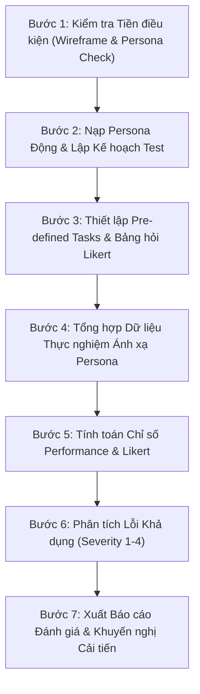

# Kế Hoạch Thực Thi: Usability Evaluation Generator

Tài liệu này mô tả chi tiết các bước xử lý kỹ thuật, cấu trúc đầu vào và định dạng đầu ra của kỹ năng `evaluation-generator` khi thực hiện đánh giá tính khả dụng cho toàn bộ dự án.

---

## 1. Dùng Kỹ Năng Này Khi

- Cần lập Kế hoạch kiểm thử tính khả dụng (**Usability Test Plan**) cho toàn bộ hệ thống Wireframe/Prototype.
- Cần tạo kịch bản các nhiệm vụ định trước (**Pre-defined Tasks**) ánh xạ từ `scenario-future/` và bảng câu hỏi khảo sát **Likert 1–5**.
- Cần tổng hợp dữ liệu thực nghiệm từ nhóm người tham gia được ánh xạ từ `personas.json` vào file dữ liệu có cấu trúc `usability-test-data.json`.
- Cần tính toán chỉ số hiệu năng (*Task Completion Rate*, *Task Completion Time*, *Error Count*) và chỉ số cảm nhận (*Mean Likert Score*).
- Cần xuất **Báo cáo Đánh giá Tính Khả Dụng hoàn chỉnh** (`usability-evaluation-report.md`) và bàn giao cho `software-product-agent`.

---

## 2. Đầu Vào Bắt Buộc (Input)

1. **Tiền điều kiện bắt buộc**:
   - Toàn bộ hệ thống Wireframe hoàn chỉnh tại `deliverables/02-interaction-design/wireframe/`.
   - Dữ liệu Persona đã hoàn thành tại `deliverables/01-user-research/persona/personas.json`.
2. Kịch bản tương lai tại `deliverables/01-user-research/scenario-future/`.
3. Quy tắc đánh giá khả dụng tại `rules/evaluation-rules.md`.
4. Hệ thống mẫu chuẩn hóa tại `templates/evaluation/`:
   - `01_usability_test_plan.md`
   - `02_predefined_tasks.md`
   - `03_post_test_likert_survey.md`
   - `04_test_data_schema.json`
   - `05_usability_evaluation_report.md`

---

## 3. Đầu Ra Mục Tiêu (Output)

Toàn bộ kết quả được lưu trữ trực tiếp tại thư mục: `deliverables/02-interaction-design/evaluation/`:

1. `usability-test-plan.md`: Tài liệu Kế hoạch kiểm thử (Mục tiêu 5 yếu tố, đối tượng tham gia nạp động từ Persona, danh mục tác vụ và tiêu chí lượng hóa).
2. `usability-test-data.json`: Tệp dữ liệu thực nghiệm có cấu trúc chứa thông số từng phiên test của các người dùng tham gia.
3. `usability-evaluation-report.md`: Báo cáo đánh giá tổng hợp hoàn chỉnh 8 phần (khớp nối trực tiếp với cấu trúc Báo cáo cuối kỳ).

---

## 4. Các Bước Thực Thi Chi Tiết (Execution Workflow)

### Chi tiết từng bước:

- **Bước 1 — Kiểm tra Tiền điều kiện**:
  - Đọc thư mục `deliverables/02-interaction-design/wireframe/` và file `deliverables/01-user-research/persona/personas.json`.
  - Nếu thiếu một trong hai $\rightarrow$ Dừng ngay lập tức (HALT).
- **Bước 2 — Nạp Persona Động & Lập Kế hoạch Test**:
  - Nạp danh sách Persona từ `personas.json`, tự động trích xuất tên, vai trò, bối cảnh và phân bổ số lượng người tham gia đại diện tương ứng.
  - Nạp template `templates/evaluation/01_usability_test_plan.md`, điền 5 mục tiêu Usability cốt lõi, danh sách nhóm người tham gia theo Persona động, và các ngưỡng lượng hóa tiêu chí thành công.
  - Xuất ra `deliverables/02-interaction-design/evaluation/usability-test-plan.md`.
- **Bước 3 — Thiết lập Pre-defined Tasks & Bảng hỏi Likert**:
  - Xây dựng các kịch bản nhiệm vụ không thiên kiến, ánh xạ từ các luồng kịch bản trong `scenario-future/` và màn hình Wireframe tương ứng.
  - Chuẩn hóa 5 câu hỏi Likert 5 mức độ thu thập cảm nhận sau test.
- **Bước 4 — Tổng hợp Dữ liệu Thực nghiệm Ánh xạ Persona**:
  - Khởi tạo file `deliverables/02-interaction-design/evaluation/usability-test-data.json` theo schema chuẩn `04_test_data_schema.json`.
  - Mỗi người tham gia (Participant) có trường `personaRef` trỏ đến ID của Persona tương ứng trong `personas.json`.
  - Ghi nhận trạng thái hoàn thành (boolean), thời gian hoàn thành (giây), số lỗi thao tác, và điểm số Likert (1–5) cho từng câu hỏi.
- **Bước 5 — Tính toán Chỉ số Performance & Likert**:
  - Tính toán cho từng tác vụ:
    - Tỷ lệ hoàn thành: $\text{Completion Rate} = \frac{\text{Số ca thành công}}{\text{Tổng số người tham gia}} \times 100\%$.
    - Thời gian trung bình: $\bar{T} = \frac{1}{N} \sum T_i$ (giây).
    - Tỷ lệ lỗi trung bình trên mỗi tác vụ.
  - Tính toán điểm Likert trung bình cho từng câu hỏi và điểm trung bình chung toàn hệ thống.
- **Bước 6 — Phân tích Lỗi Khả dụng (Usability Findings)**:
  - Tổng hợp các lỗi/bối rối người dùng gặp phải dựa trên quan sát thực tế luồng giao diện.
  - Phân loại mức độ nghiêm trọng: Cosmetic (1), Minor (2), Major (3), Catastrophe (4).
- **Bước 7 — Xuất Báo cáo Đánh giá Tổng hợp**:
  - Nạp template `templates/evaluation/05_usability_evaluation_report.md`.
  - Điền toàn bộ số liệu, danh sách phân bổ Persona động, bảng phân tích lỗi và ma trận khuyến nghị cải tiến UI cho `software-product-agent`.
  - Lưu vào `deliverables/02-interaction-design/evaluation/usability-evaluation-report.md`.
