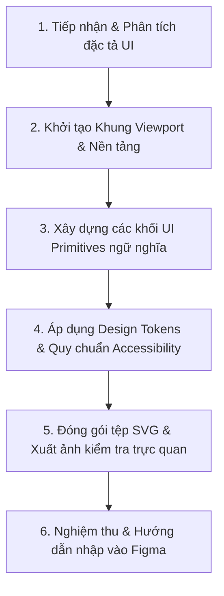

# Kế hoạch thực thi: Figma SVG Generator

## 1. Mục đích

Chuyển đổi các đặc tả giao diện từ `wireframe-agent` (Rubric 7), `prototype-agent` (Rubric 6) hoặc yêu cầu thiết kế trực tiếp thành các tệp bản vẽ vector SVG chuẩn 100% tương thích với Figma Canvas, hỗ trợ người dùng kéo thả hoặc dán trực tiếp (`Ctrl + V`) để chỉnh sửa đầy đủ Layer, Group và Text.

---

## 2. Khi nào sử dụng

- Khi `wireframe-agent` cần sinh bản vẽ vector cho các màn hình theo 5 trạng thái (*Main Flow*, *Loading*, *Empty*, *Error*, *Success*).
- Khi `prototype-agent` cần tạo các Interactive Frame chuẩn Figma, gắn định danh ngữ nghĩa `<g id="...">` để liên kết luồng tương tác (Smart Animate, Hotspots).
- Khi người dùng yêu cầu thiết kế nhanh hoặc tùy biến một màn hình/thành phần UI độc lập cho dự án.

---

## 3. Đầu vào (Input)

- Đặc tả màn hình và hành trình người dùng (`deliverables/01-user-research/scenario-future/` hoặc kịch bản Wireframe/Prototype).
- Kích thước Viewport mục tiêu: Mobile tiêu chuẩn (`375x812`), Tablet (`768x1024`), Desktop (`1440x900`).
- Danh sách thành phần UI yêu cầu: Status Bar, Header, Timeline Stepper 4 mốc, Time Slot Picker, Service Card, Form Input, CTA Button, Bottom Nav.
- Bảng Design Tokens chuẩn HCI được quy định trong `AGENTS.md` và `skills/figma-svg-generator/SKILL.md`.

---

## 4. Đầu ra (Output)

- Tệp SVG vector chuẩn Figma tại thư mục `deliverables/`:
  - `deliverables/02-interaction-design/wireframe/<screen-name>-wireframe.svg`
  - `deliverables/02-interaction-design/prototype/<flow-name>-prototype.svg`
- Ảnh kết xuất PNG xem trước độ nét cao (tạo qua `tools/render-html-to-png.py` khi cần kiểm tra hiển thị).
- Cấu trúc Layer Figma chuẩn hóa: Mỗi khối UI được bọc trong thẻ `<g id="...">` ngữ nghĩa (ví dụ: `Header`, `Progress_Stepper`, `Card_Service_Poodle`, `Button_Confirm_Booking`).

---

## 5. Quy trình làm việc (Workflow)



### Chi tiết các bước thực hiện:

1. **Bước 1 — Tiếp nhận & Phân tích đặc tả UI**:
   - Xác định loại màn hình, mục tiêu người dùng, và trạng thái hiển thị (Luồng chính, Đang tải Skeleton, Không có dữ liệu, Lỗi, Thành công).
   - Chọn kích thước Viewport chuẩn (mặc định Mobile-first: `375x812`).

2. **Bước 2 — Khởi tạo Khung Viewport & Nền tảng**:
   - Sử dụng `FigmaSvgBuilder` từ `tools/generate-figma-svg.py` hoặc khởi tạo cấu trúc SVG chuẩn:
     ```xml
     <svg xmlns="http://www.w3.org/2000/svg" viewBox="0 0 375 812" width="375" height="812">
     ```
   - Thêm nền Frame (`<rect id="Frame_Background" ... rx="28"/>`) và thanh trạng thái (`<g id="Status_Bar">`).

3. **Bước 3 — Xây dựng các khối UI Primitives ngữ nghĩa**:
   - Bổ sung Top Navigation / Header kèm nút Back và tiêu đề trang.
   - Thêm các thành phần đặc thù theo kịch bản:
     * **Timeline Stepper 4 mốc**: Đã nhận ➔ Đang chăm sóc ➔ Hoàn tất ➔ Chờ đón (kèm đánh số mốc, icon và nhãn trạng thái).
     * **Thẻ dịch vụ / Hồ sơ thú cưng**: Bo góc `rx="12-14"`, viền mờ `#E2E8F0`, badge tag dị ứng `#BE123C`.
     * **Lưới chọn khung giờ (Time Slot Grid)**: Các ô giờ bấm chọn trực quan.
     * **Nút hành động chính (Primary CTA Button)**: Nút Full-width bo góc mềm mại `#0D766E`.
     * **Bottom Navigation Bar**: 4 tab điều hướng cố định chân trang.

4. **Bước 4 — Áp dụng Design Tokens & Quy chuẩn Accessibility**:
   - *Bảng màu chuẩn*:
     * Primary: `#0D766E` (Teal), `#0F4C45` (Teal đậm), `#F0FDFA` (Light BG), `#CCFBF1` (Light Border).
     * Accent & Alert: Cam `#E06236`, Hổ phách `#D97706`, Đỏ dị ứng `#BE123C`.
     * Neutral: Nền `#F8FAFC`, Thẻ `#FFFFFF`, Viền `#E2E8F0`, Chữ chính `#0F172A`, Chữ phụ `#64748B`.
   - *Typography*: `Inter, -apple-system, BlinkMacSystemFont, "Segoe UI", Roboto, sans-serif`.
   - *Accessibility*: Đảm bảo độ tương phản chữ, không biểu đạt trạng thái chỉ bằng màu sắc (luôn kết hợp Icon + Text + Badge).

5. **Bước 5 — Đóng gói tệp SVG & Xuất ảnh kiểm tra trực quan**:
   - Ghi mã nguồn SVG ra tệp mục tiêu trong `deliverables/`.
   - (Tùy chọn) Chạy `python3 tools/render-html-to-png.py` để kết xuất ảnh PNG kiểm tra bố cục và lề mép.

6. **Bước 6 — Nghiệm thu & Hướng dẫn nhập vào Figma**:
   - Kiểm tra mã SVG: không chứa thẻ không hợp lệ, phân cấp `<g id="...">` rõ ràng.
   - Bàn giao đường dẫn tệp SVG và hướng dẫn kéo thả trực tiếp hoặc `Ctrl + V` vào Figma Canvas.
