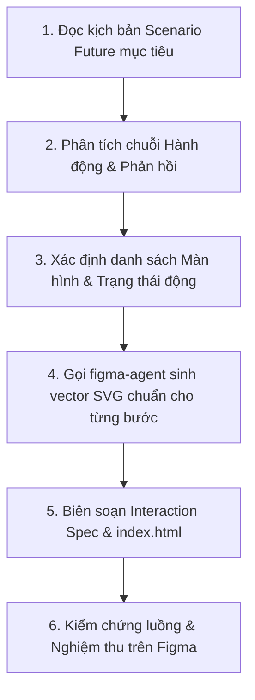

# Kế hoạch thực thi: Prototype Generator (Ánh xạ Động từ Scenario Future)

## 1. Mục đích

Chuyển đổi **bất kỳ kịch bản tương tác tương lai (Scenario Future / To-Be Scenarios) nào** thành luồng Interactive Prototype hoàn chỉnh chuẩn Figma Canvas theo Rubric mục 6, chứng minh trực quan cách quy trình mới giải quyết triệt để các bất cập của quy trình cũ.

---

## 2. Khi nào sử dụng

- Khi người dùng chỉ định một kịch bản Scenario Future cụ thể (`scenario-future-<goal-id>.md`) cần dựng Prototype.
- Khi cần tạo ma trận tương tác (Interaction Spec), liên kết Frame và phiên bản Figma cho các hành trình người dùng To-Be.

---

## 3. Đầu vào (Input)

- **Kịch bản Scenario Future mục tiêu**: `deliverables/01-user-research/scenario-future/<persona-id>/scenario-future-<goal-id>.md`.
- Dữ liệu Persona & Value Proposition (`deliverables/01-user-research/persona/personas.json`, `value-proposition/`).
- Design Tokens chuẩn HCI trong `AGENTS.md` (Teal `#0D766E`, Coral `#E06236`, Amber `#D97706`, Rose `#BE123C`, Font `Inter`).

---

## 4. Đầu ra (Output)

Tại thư mục `deliverables/02-interaction-design/prototype/<persona-id>/<goal-id>/` (hoặc thư mục luồng tương ứng):

- Bộ tệp bản vẽ SVG Interactive Frame chuẩn Figma tương ứng với từng bước trong kịch bản đó.
- `index.html`: Giao diện Web hiển thị luồng tương tác với các bước chuyển cảnh và chú thích theo đúng diễn biến câu chuyện.
- `interaction-spec.md`: Bảng ma trận đối ứng từng hành động trong kịch bản với Frame ID, Hotspot, Trigger, Transition và Phản hồi hệ thống.

---

## 5. Quy trình làm việc (Workflow)

### Chi tiết các bước thực hiện:

1. **Bước 1 — Xác định kịch bản đầu vào & Lựa chọn của người dùng**:
   - Quét toàn bộ các kịch bản trong `deliverables/01-user-research/scenario-future/`.
   - Hiển thị danh sách 6 kịch bản Scenario Future (Persona 1: Goal 1-3, Persona 2: Goal 1-3) để người dùng chọn kịch bản mục tiêu cần dựng Prototype nếu chưa được chỉ định trước.
2. **Bước 2 — Phân rã chuỗi Hành động & Phản hồi (Step-by-step Interaction Decomposition)**:
   - Trích xuất từng nhịp tương tác:
     * *Bước 1 (Khởi đầu)*: Người dùng mở ứng dụng từ đâu? Màn hình ban đầu hiển thị gì?
     * *Bước 2..N (Tương tác chính)*: Người dùng thao tác gì (chọn gói, chọn giờ, xem ảnh, gắn ghi chú...)? Hệ thống phản hồi tức thì ra sao?
     * *Bước cuối (Hoàn thành)*: Trạng thái thành công hoặc thông báo giải tỏa điểm đau của Persona.
3. **Bước 3 — Xác định cấu trúc Màn hình & Trạng thái (Dynamic Screen Mapping)**:
   - Quyết định số lượng Frame cần vẽ và các trạng thái đặc thù cho kịch bản đó (không gán cứng số lượng hay loại màn hình).
4. **Bước 4 — Gọi Subagent `figma-agent`**:
   - Chuyển giao đặc tả cho `figma-agent` để sinh mã SVG vector chuẩn Figma cho từng màn hình, áp dụng đúng Design Tokens và nhóm `<g id="...">` ngữ nghĩa.
5. **Bước 5 — Biên soạn Interaction Spec & Giao diện Overview**:
   - Xuất tài liệu `interaction-spec.md` mô tả ma trận nối dây Prototype (Trigger, Transition: Smart Animate 300ms, Hotspots) và tệp `index.html`.
6. **Bước 6 — Kiểm chứng luồng & Nghiệm thu**:
   - Đối chiếu lại từng câu trong kịch bản To-Be với Prototype để đảm bảo toàn bộ quy trình mới đã được thể hiện trọn vẹn và nhất quán.

