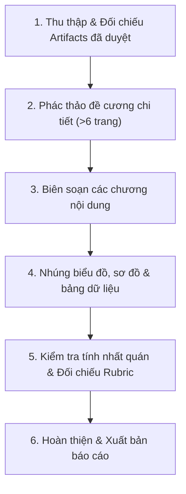

# Kế hoạch Soạn thảo Báo cáo Cuối kỳ (Report Agent Plan)

## 1. Mục tiêu
Biên soạn báo cáo đồ án môn Tương tác Người–Máy (CSC12106) đạt tiêu chuẩn xuất sắc (Rubric mục 10), dung lượng tối thiểu 6 trang, tự chứa và tích hợp toàn bộ các bằng chứng thiết kế đã hoàn thành.

---

## 2. Quy trình Thực hiện (Workflow)

### Chi tiết các bước:

1. **Bước 1 — Thu thập Artifacts**:
   - Rà soát hồ sơ Persona & Value Proposition (`deliverables/01-user-research/`).
   - Rà soát Scenario hiện tại, Scenario tương lai, Storyboard (`deliverables/01-user-research/`).
   - Rà soát 5 trạng thái Wireframe và 6 màn hình Prototype (`deliverables/02-interaction-design/`).
   - Rà soát cấu trúc React TypeScript (`src/`).

2. **Bước 2 — Biên soạn Báo cáo Tự chứa**:
   - Trình bày mạch lạc, logic từ vấn đề thực tế (Problem Statement) ➔ Nghiên cứu người dùng ➔ Giải pháp thiết kế ➔ Hiện thực sản phẩm ➔ Đánh giá tính khả dụng.
   - Nhúng bảng ma trận tương tác (Interaction Matrix) và bảng đối chiếu Heuristics.

3. **Bước 3 — Nghiệm thu theo Rubric**:
   - Kiểm tra dung lượng $\ge 6$ trang.
   - Đảm bảo 100% số liệu trung thực, có trích dẫn nguồn.
   - Không chứa bất kỳ emoji màu mè hay thông số thiết bị cũ ($375\text{px}$).
