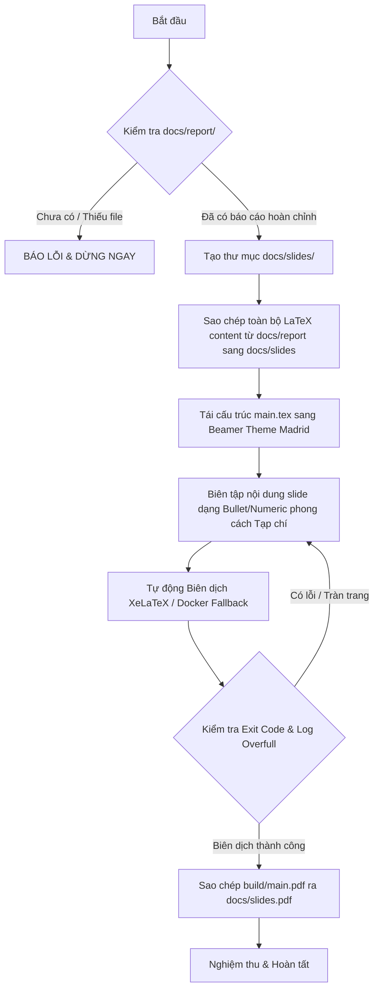

# Kế Hoạch Soạn Slide Thuyết Trình Báo Cáo (Slides Generator Plan)

## 1. Mục Đích

Tổ chức quy trình chuyển đổi toàn bộ nội dung từ **Báo cáo cuối kỳ** (`docs/report/`) thành bộ **Slide thuyết trình LaTeX Beamer với theme Madrid**, phong cách tạp chí truyền thông (Editorial Media Magazine), phục vụ buổi báo cáo và bảo vệ đồ án môn học Tương tác Người -- Máy (CSC12106).

---

## 2. Khi Nào Dùng Skill Này

- Khi nhóm sinh viên hoặc Agent đã hoàn thành Báo cáo cuối kỳ tại `docs/report/` và cần tạo Slide thuyết trình cho buổi báo cáo.
- Cần tóm tắt các phát hiện và thành quả nghiên cứu/thiết kế thành các ý chính dạng bullet, danh sách số, hộp số liệu (metric callouts), giảm tải văn bản dày đặc.
- Cần xuất bản file slide chuẩn hóa dạng PDF (`docs/slides.pdf`) để trình chiếu và nộp kèm hồ sơ cuối kỳ.

---

## 3. Đầu Vào Bắt Buộc (Strict Preconditions)

- **Báo cáo cuối kỳ tại `docs/report/` — Tiền điều kiện Tiên quyết**:
  - `docs/report/main.tex`
  - `docs/report/content/` (chứa các chương từ 01 đến 09)
  - `docs/report/img/` (hình ảnh, biểu đồ, mockup, storyboard, wireframe)
- **Quy tắc Kiểm tra Tiền điều kiện**:
  - Nếu `docs/report/` chưa tồn tại hoặc thiếu file/nội dung $\rightarrow$ **DỪNG LẠI NGAY LẬP TỨC (HALT)** và in thông báo lỗi:
    > `[LỖI TIỀN ĐIỀU KIỆN]: Chưa tìm thấy báo cáo tại docs/report/! Slides Agent bắt buộc phải dựa hoàn toàn trên Báo cáo đã hoàn tất. Vui lòng chạy report-agent để hoàn thiện báo cáo trước khi tạo slide.`
  - Tuyệt đối không được thực hiện bất kỳ bước tiếp theo nào khi chưa thỏa mãn tiền điều kiện.

---

## 4. Đầu Ra Cụ Thể (Outputs)

1. **Thư mục mã nguồn LaTeX**: `docs/slides/`
   - `main.tex`: Khai báo `\documentclass{beamer}`, `\usetheme{Madrid}`, cấu hình màu sắc, package và font tiếng Việt UTF-8.
   - `content/`: Các file frame được biên tập súc tích tương ứng với các phần của báo cáo.
   - `img/`: Thư mục hình ảnh được sao chép và kế thừa từ báo cáo.
   - `build/`: Thư mục chứa các tệp phụ trợ và file `main.pdf` biên dịch tạm thời.
2. **File PDF Trình chiếu Xuất bản**: `docs/slides.pdf`
   - Được tự động sao chép từ `docs/slides/build/main.pdf` ra ngoài ngay trong thư mục `docs/`.
   - Đảm bảo chất lượng hiển thị sắc nét, không lỗi font, không tràn biên (Zero Overfull).

---

## 5. Quy Chuẩn Nội Dung & Phong Cách Trình Bày

- **Phong cách Tạp chí truyền thông (Editorial Media Magazine)**:
  - Tiêu đề slide giật tít tinh tế (Editorial Headlines), làm nổi bật insight, phát hiện mới hoặc thông điệp cốt lõi thay vì tiêu đề số mục khô cứng.
  - Sử dụng văn phong sắc sảo, ngắn gọn, cuốn hút, giàu tính thuyết phục.
- **Chắt lọc thông tin đa dạng (Bullet, Numeric, Callouts)**:
  - Tuyệt đối không đưa cả đoạn văn bản từ báo cáo lên slide.
  - Sử dụng danh sách gạch đầu dòng (`itemize`) có in đậm từ khóa đầu câu (`\textbf{Từ khóa:}`).
  - Sử dụng danh sách đánh số (`enumerate`) cho các bước quy trình, thứ tự ưu tiên hoặc kết quả thử nghiệm.
  - Sử dụng các khối Beamer (`block`, `exampleblock`, `alertblock`) và chia cột (`columns`) để làm nổi bật số liệu (metric callouts), trích dẫn người dùng (user quotes) và bảng so sánh trực quan (As-Is vs To-Be).

---

## 6. Quy Trình Thực Hiện (Workflow)

### Chi tiết các bước:

1. **Bước 1 — Kiểm tra tiền điều kiện**: Quét thư mục `docs/report/`. Nếu thiếu $\rightarrow$ Báo lỗi và dừng ngay.
2. **Bước 2 — Khởi tạo & Sao chép**: Tạo thư mục `docs/slides/`, sao chép toàn bộ tài nguyên LaTeX từ `docs/report/` sang `docs/slides/`.
3. **Bước 3 — Chuyển đổi mã nguồn**: Thay thế `main.tex` bằng cấu hình Beamer theme Madrid (`\usetheme{Madrid}`), cấu hình font tiếng Việt và hệ màu nhận diện Petcare.
4. **Bước 4 — Biên tập Slide frames**: Chuyển thể nội dung từ 9 chương báo cáo thành 10–14 slide frames súc tích theo quy chuẩn văn phong tạp chí truyền thông.
5. **Bước 5 — Biên dịch tự động**: Chạy lệnh build (ưu tiên Local XeLaTeX trên máy host, fallback qua Docker container). Kiểm tra log `main.log` để đảm bảo Zero Overfull.
6. **Bước 6 — Xuất bản**: Tự động sao chép `docs/slides/build/main.pdf` ra `docs/slides.pdf` và tiến hành nghiệm thu.

---

## 7. Tiêu Chí Nghiệm Thu (Acceptance Checklist)

- [ ] **Tiền điều kiện**: Báo cáo tại `docs/report/` có thật và đã hoàn thiện.
- [ ] **Cô lập tài nguyên**: Thao tác tạo slide diễn ra trong `docs/slides/`, không gây ảnh hưởng hay ghi đè lên `docs/report/`.
- [ ] **Giao diện chuẩn Madrid**: Áp dụng chuẩn theme `Madrid`, có thanh điều hướng tiêu đề, tác giả, số trang rõ ràng.
- [ ] **Văn phong Tạp chí truyền thông**: Tiêu đề giật tít thu hút, nội dung định dạng bullet, numeric, metric cards, không có đoạn văn dài.
- [ ] **Zero Overfull**: Không có slide nào bị tràn nội dung hoặc vỡ khung hình.
- [ ] **Xuất bản thành công**: File `docs/slides.pdf` đã hiện diện ngay trong `docs/` với nội dung hoàn chỉnh.
