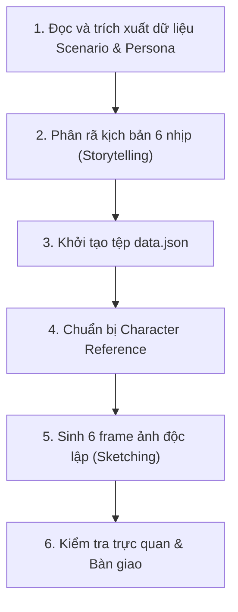

# Kế hoạch thực thi: Storyboard Detail Generator

## 1. Mục đích

Phân tích một Scenario Future cụ thể thành kịch bản 6 khung hình chi tiết, tạo metadata cấu trúc và sinh toàn bộ 6 ảnh panel vuông 1:1 theo phong cách người que cổ điển nét đơn.

## 2. Khi nào sử dụng

- Khi cần chuẩn bị kịch bản chi tiết và bộ tài nguyên ảnh panel đơn lẻ cho một Persona–Goal trước khi ghép thành Storyboard hoàn chỉnh.

## 3. Đầu vào (Input)

- `deliverables/01-user-research/scenario-future/<persona-id>/scenario-future-<goal-id>.md`
- `deliverables/01-user-research/persona/personas.json`
- `deliverables/01-user-research/value-proposition/value-proposition.json`

## 4. Đầu ra (Output)

Tại thư mục `deliverables/02-interaction-design/storyboard/<persona-id>/<goal-id>/`:
- `data.json`: Tệp dữ liệu cấu trúc chứa tiêu đề, bối cảnh và thông tin chi tiết của 6 frame.
- `assets/frame-1.png` đến `assets/frame-6.png`: 6 tệp ảnh panel vuông (tỷ lệ 1:1).
- `character-reference.png`: Ảnh tham chiếu nhân vật và thú cưng (lưu tại thư mục cha `<persona-id>/`).

## 5. Quy trình làm việc (Workflow)

1. **Bước 1 — Tiếp nhận & Trích xuất dữ liệu**:
   - Đọc Scenario Future, Persona và Value Proposition tương ứng để xác định bối cảnh, nhiệm vụ, thiết bị, điểm đau và giá trị mang lại.
2. **Bước 2 — Phân rã kịch bản 6 nhịp**:
   - Phân tích câu chuyện thành đúng 6 frame theo nhịp: *Bối cảnh/Trigger $\rightarrow$ Mở app/Kiểm tra hồ sơ $\rightarrow$ Thao tác đặt lịch $\rightarrow$ Bàn giao thực tế $\rightarrow$ Quy trình chăm sóc/Tiến độ $\rightarrow$ Kết quả & Lưu lịch sử*.
3. **Bước 3 — Khởi tạo tệp `data.json`**:
   - Ghi nhận đầy đủ tên bước (`stepName`), lời dẫn câu chuyện (`story`), hành động người dùng (`userAction`), phản hồi hệ thống (`systemFeedback`), cảm xúc (`emotion`) và prompt sinh ảnh cho cả 6 frame.
4. **Bước 4 — Chuẩn bị Character Reference**:
   - Kiểm tra hoặc tạo tệp `character-reference.png` mẫu người que nét đơn để giữ tính nhất quán nhận diện.
5. **Bước 5 — Sinh 6 frame ảnh độc lập**:
   - Sinh lần lượt từ `frame-1.png` đến `frame-6.png` vào thư mục `assets/` theo đúng prompt phác thảo người que nét đơn.
6. **Bước 6 — Kiểm tra trực quan & Bàn giao**:
   - Đối chiếu chất lượng từng ảnh với quy tắc thiết kế (nét đơn, không che khuất, UI rõ chữ) và sẵn sàng bàn giao cho `storyboard-generator`.
