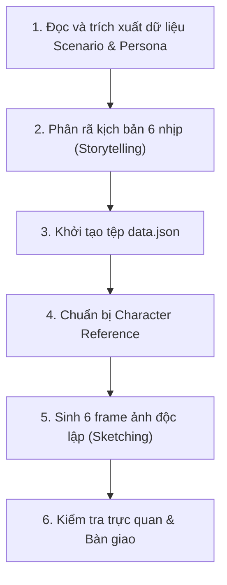

# Kế hoạch thực thi: Storyboard Detail Generator

## 1. Mục đích

Phân tích một Scenario Future cụ thể thành kịch bản 6 khung hình chi tiết, tạo metadata cấu trúc và sinh toàn bộ 6 ảnh panel PNG ngang `1280×720` (`16:9`) theo phong cách *Expressive Stick-figure UI Storyboard*.

## 2. Khi nào sử dụng

- Khi cần chuẩn bị kịch bản chi tiết và bộ tài nguyên ảnh panel đơn lẻ cho một Persona–Goal trước khi ghép thành Storyboard hoàn chỉnh.

## 3. Đầu vào (Input)

- `deliverables/01-user-research/scenario-future/<persona-id>/scenario-future-<goal-id>.md`
- `deliverables/01-user-research/persona/personas.json`
- `deliverables/01-user-research/value-proposition/value-proposition.json`
- `rules/storyboard-rules.md`

## 4. Đầu ra (Output)

Tại thư mục `deliverables/02-interaction-design/storyboard/<persona-id>/<goal-id>/`:
- `data.json`: Tệp dữ liệu cấu trúc chứa tiêu đề, bối cảnh và thông tin chi tiết của 6 frame.
- `assets/frame-1.png` đến `assets/frame-6.png`: 6 tệp ảnh panel PNG kích thước chính xác `1280×720`, tỷ lệ `16:9`.
- `character-reference.png`: Ảnh tham chiếu PNG kích thước chính xác `1024×1024`, lưu trong cùng thư mục `<persona-id>/<goal-id>/` để bộ bàn giao tự chứa.

## 5. Quy trình làm việc (Workflow)

1. **Bước 1 — Tiếp nhận & Trích xuất dữ liệu**:
   - Đọc Scenario Future, Persona và Value Proposition tương ứng để xác định bối cảnh, nhiệm vụ, thiết bị, điểm đau và giá trị mang lại.
   - Mặc định chỉ xử lý một cặp Persona–Goal. Chỉ xử lý batch khi người dùng yêu cầu rõ ràng, và mỗi cặp phải được thực thi độc lập.
   - Kiểm tra các input tồn tại, đọc được và khớp `persona_id`, `goal_id`. Nếu thiếu hoặc không khớp thì dừng và báo rõ.
   - Kiểm tra thư mục đích và mọi artifact đích. Nếu bất kỳ mục nào đã tồn tại thì dừng; không ghi đè và không tự tạo phiên bản.
2. **Bước 2 — Phân rã kịch bản 6 nhịp**:
   - Phân tích câu chuyện thành đúng 6 nhịp trung tính: *Bối cảnh/Trigger $\rightarrow$ Nhu cầu/Chuẩn bị $\rightarrow$ Hành động then chốt $\rightarrow$ Diễn biến/Phản hồi $\rightarrow$ Cao trào/Giá trị $\rightarrow$ Kết quả/Cảm xúc*.
   - Suy ra nội dung cụ thể của từng nhịp từ đúng Scenario Future; không áp đặt tính năng, hành động hoặc kết quả không được Scenario hỗ trợ.
3. **Bước 3 — Khởi tạo tệp `data.json`**:
   - Ghi nhận đầy đủ tên bước (`stepName`), lời dẫn câu chuyện (`story`), hành động người dùng (`userAction`), phản hồi hệ thống (`systemFeedback`), cảm xúc (`emotion`), prompt sinh ảnh và `sourceRefs` cho cả 6 frame.
   - Khai báo metadata cấp Storyboard: `frameSize = { width: 1280, height: 720, aspectRatio: "16:9", format: "png" }` và `canvasSize = { width: 1600, height: 900, aspectRatio: "16:9", format: "png" }`.
   - Mỗi `sourceRefs` phải chỉ tới Persona, Value Proposition và Scenario Future hỗ trợ trực tiếp nội dung frame.
   - Chỉ dùng direct quote hoặc Thought Bubble nguyên văn khi nguồn có câu nguyên văn tương ứng; trường hợp khác paraphrase và không đặt trong ngoặc kép như lời nói thật.
4. **Bước 4 — Chuẩn bị Character Reference**:
   - Tạo tệp `<persona-id>/<goal-id>/character-reference.png` chính xác `1024×1024` theo diện mạo có evidence của Persona: tóc, dấu hiệu nhận diện, trang phục viền đơn, dáng tự nhiên và biểu cảm rõ; không anatomy chi tiết hoặc 3D.
   - Chỉ dùng bảng màu thiết kế line art `#000` trên nền `#fff`; không màu, mảng tô xám, gradient, shadow hoặc shading. Anti-aliasing kỹ thuật ở mép nét được chấp nhận.
5. **Bước 5 — Sinh 6 frame ảnh độc lập**:
   - Sinh lần lượt từ `frame-1.png` đến `frame-6.png` vào thư mục `assets/`; mỗi prompt phải nêu rõ bố cục ngang `16:9` và đầu ra PNG chính xác `1280×720`, đồng thời tuân thủ *Expressive Stick-figure UI Storyboard* và Negative Prompt trong Skill.
   - Chỉ thêm nhân vật phụ, thú cưng, bối cảnh, đồ vật và UI được Scenario/evidence hỗ trợ. UI phone mockup đủ chi tiết để hiểu control liên quan nhưng không trở thành Wireframe hoàn chỉnh.
6. **Bước 6 — Kiểm tra trực quan & Bàn giao**:
   - Mở và đối chiếu từng ảnh: bảng màu thiết kế chỉ có line art `#000` trên `#fff`, không màu/mảng tô xám/gradient/shadow; nhân vật biểu cảm đúng Persona; UI đủ hiểu tương tác; không có chi tiết thiếu evidence và không che khuất nhau.
   - Kiểm tra kích thước pixel chính xác: 6 frame đều `1280×720` (`16:9`) và `character-reference.png` là `1024×1024` (`1:1`). Sai một pixel hoặc sai tỷ lệ thì dừng, không bàn giao.
   - Chỉ bàn giao cho `storyboard-generator` khi cả `character-reference.png` và 6 frame đều đạt style.
