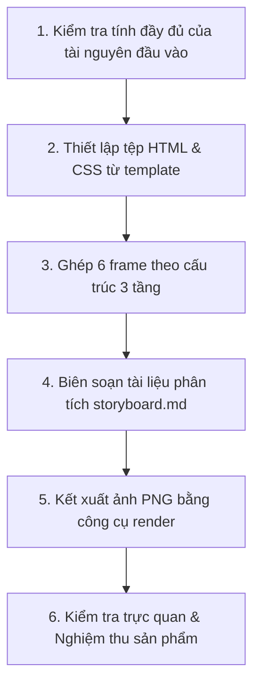

# Kế hoạch thực thi: Storyboard Generator

## 1. Mục đích

Tổng hợp toàn bộ các asset ảnh đơn lẻ và metadata từ `data.json` thành sản phẩm Storyboard hoàn chỉnh gồm mã nguồn Web (HTML/CSS), tài liệu phân tích (Markdown) và hình ảnh kết xuất A4 khổ ngang (PNG).

## 2. Khi nào sử dụng

- Khi đã có sẵn 6 ảnh panel vuông trong `assets/` và tệp dữ liệu `data.json` chuẩn hóa từ `storyboard-detail-generator`.

## 3. Đầu vào (Input)

- `deliverables/02-interaction-design/storyboard/<persona-id>/<goal-id>/data.json`
- `deliverables/02-interaction-design/storyboard/<persona-id>/<goal-id>/assets/frame-1.png` đến `frame-6.png`
- `templates/storyboard/index.html` và `templates/storyboard/style.css`

## 4. Đầu ra (Output)

Tại thư mục `deliverables/02-interaction-design/storyboard/<persona-id>/<goal-id>/`:

- `storyboard.html`: Trang HTML hiển thị bố cục 6 khung hình 3 tầng.
- `style.css`: Bảng định kiểu CSS comic sketch với font viết tay `Patrick Hand`.
- `storyboard.md`: Tài liệu Markdown tổng hợp hành trình và bảng chi tiết 6 khung hình.
- `storyboard.png`: Hình ảnh Storyboard tổng hợp chất lượng cao (A4 khổ ngang).

## 5. Quy trình làm việc (Workflow)

1. **Bước 1 — Kiểm tra đầu vào**:
   - Xác định sự tồn tại của 6 ảnh trong `assets/` và tệp `data.json`.
2. **Bước 2 — Thiết lập tệp HTML & CSS**:
   - Sao chép `style.css` từ `templates/storyboard/style.css` sang thư mục deliverable.
   - Khởi tạo tệp `storyboard.html` từ template mẫu.
3. **Bước 3 — Ghép 6 frame vào HTML**:
   - Đọc dữ liệu từ `data.json` và chèn lần lượt 6 khối frame theo bố cục 3 tầng: *Header (Số + Tên bước) $\rightarrow$ Figure (Ảnh 1:1) $\rightarrow$ Caption (Lời dẫn đáy)*.
4. **Bước 4 — Biên soạn tài liệu `storyboard.md`**:
   - Tổng hợp thông tin Persona, Goal, bảng Context of Use và bảng phân rã chi tiết 6 frame.
5. **Bước 5 — Kết xuất ảnh PNG**:
   - Chạy script `tools/render-html-to-png.py` để kết xuất file `storyboard.png` khổ ngang sắc nét.
6. **Bước 6 — Kiểm tra trực quan & Nghiệm thu**:
   - Mở xem file `storyboard.png` để đảm bảo toàn bộ viền khung và dòng chữ caption ở hàng đáy hiển thị 100% trọn vẹn, không bị cắt mép.
7. **Bước 7 - Sửa sai nếu có**
   - Nếu file `storyboard.png` không đạt chuẩn, làm lại.
