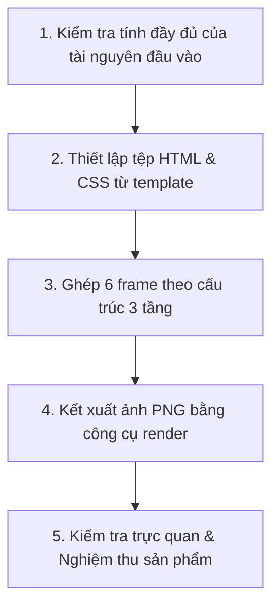

# Kế hoạch thực thi: Storyboard Generator

## 1. Mục đích

Tổng hợp toàn bộ các asset ảnh đơn lẻ và metadata từ `data.json` thành sản phẩm Storyboard tự chứa gồm mã nguồn Web (HTML/CSS), ảnh tham chiếu nhân vật và hình ảnh PNG `1600×900` (`16:9`).

## 2. Khi nào sử dụng

- Khi đã có sẵn 6 ảnh panel PNG `1280×720` (`16:9`) trong `assets/`, ảnh tham chiếu `1024×1024` và tệp `data.json` chuẩn hóa từ `storyboard-detail-generator`.

## 3. Đầu vào (Input)

- `deliverables/02-interaction-design/storyboard/<persona-id>/<goal-id>/data.json`
- `deliverables/02-interaction-design/storyboard/<persona-id>/<goal-id>/assets/frame-1.png` đến `frame-6.png`
- `deliverables/02-interaction-design/storyboard/<persona-id>/<goal-id>/character-reference.png`
- `templates/storyboard/index.html` và `templates/storyboard/style.css`

## 4. Đầu ra (Output)

Tại thư mục `deliverables/02-interaction-design/storyboard/<persona-id>/<goal-id>/`:

- `storyboard.html`: Trang HTML hiển thị bố cục 6 khung hình 3 tầng.
- `style.css`: Bảng định kiểu CSS comic sketch với font viết tay `Patrick Hand`.
- `storyboard.png`: Hình ảnh Storyboard tổng hợp kích thước chính xác `1600×900`, tỷ lệ `16:9`.

## 5. Quy trình làm việc (Workflow)

1. **Bước 1 — Kiểm tra đầu vào**:
   - Mặc định chỉ xử lý một cặp Persona–Goal; chỉ chạy batch khi người dùng yêu cầu rõ ràng và mỗi cặp được xử lý độc lập.
   - Xác định sự tồn tại, khả năng đọc và tính khớp định danh của `data.json`, `character-reference.png`, đúng 6 ảnh trong `assets/` và hai template.
   - Xác nhận `data.json` có đúng 6 frame, đủ trường bắt buộc, `frameSize` là `1280×720`, `canvasSize` là `1600×900`, mỗi frame có `sourceRefs` hợp lệ và mọi `imagePath` trỏ đúng asset.
   - Kiểm tra kích thước pixel thực tế: từng frame đúng `1280×720` (`16:9`) và `character-reference.png` đúng `1024×1024` (`1:1`). Sai một pixel hoặc sai tỷ lệ thì dừng.
   - Mở kiểm tra `character-reference.png` và 6 frame: bảng màu thiết kế chỉ có line art `#000` trên nền `#fff`, không màu/mảng tô xám/gradient/shadow; nhân vật đúng style *Expressive Stick-figure*, UI đủ hiểu tương tác và mọi chi tiết đều có evidence.
   - Nếu thiếu hoặc sai input thì dừng và báo rõ. Nếu `storyboard.html`, `style.css`, `storyboard.png` hoặc artifact đích cần tạo đã tồn tại thì dừng; không ghi đè và không tự tạo phiên bản.
2. **Bước 2 — Thiết lập tệp HTML & CSS**:
   - Sao chép `style.css` từ `templates/storyboard/style.css` sang thư mục deliverable.
   - Khởi tạo tệp `storyboard.html` từ template mẫu.
   - Điều chỉnh bản `style.css` trong thư mục deliverable để canvas vừa chính xác viewport `1600×900`, Figure có tỷ lệ `16:9`, lưới 3×2 cùng header/caption không overflow. Không sửa template nguồn.
3. **Bước 3 — Ghép 6 frame vào HTML**:
   - Đọc dữ liệu từ `data.json` và chèn lần lượt 6 khối frame theo bố cục 3 tầng: *Header (Số + Tên bước) $\rightarrow$ Figure (Ảnh 16:9) $\rightarrow$ Caption (Lời dẫn đáy)*.
4. **Bước 4 — Kết xuất ảnh PNG**:
   - Chạy chính xác: `python tools/render-html-to-png.py "<output-dir>/storyboard.html" "<output-dir>/storyboard.png" --width 1600 --height 900 --scale 1 --wait-ms 1500`.
5. **Bước 5 — Kiểm tra trực quan & Nghiệm thu**:
   - Mở xem file `storyboard.png` để đảm bảo toàn bộ viền khung và dòng chữ caption ở hàng đáy hiển thị 100% trọn vẹn, không bị cắt mép.
   - Kiểm tra kích thước pixel của `storyboard.png` chính xác `1600×900` và tỷ lệ `16:9`; sai một pixel hoặc có overflow/crop thì không nghiệm thu.
   - Xác nhận thành phẩm dùng bảng màu thiết kế `#000` trên `#fff`, không màu, mảng tô xám, gradient, shadow hoặc shading; anti-aliasing kỹ thuật được chấp nhận. Nhân vật đúng Persona và style *Expressive Stick-figure*; UI đủ chi tiết để hiểu tương tác nhưng không thành Wireframe hoàn chỉnh.
   - Nếu ảnh không đạt, dừng và báo lỗi nghiệm thu; không ghi đè artifact hoặc tự tạo phiên bản mới.
